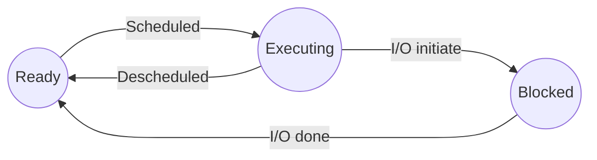

A **program** is a set of instructions in a computer's memory

A running program is a **process** along with
- A a program counter that keeps track of which program to run next
- register to store immidiate data
- Where instructions are stored in the address space
- Where to find the parameters of the current function **stack and frame pointers**

## #Scheduler
- CPU can only run one process at a time
- Other process go in a ready queue
- If a process needs to perform I/O, it goes into the blocked queue

Every process starts in an **init state**
When a process dies, it goes into its **final state**
If the parent dies before the child, it becomes an **orphan**

| Fork | Exec | Wait |
| -----| -----| ------|
|Create another child process that is a copy of the same code and begins from the line where Fork was called | Change the program of the currently executing process | Do nothing until child process has terminated 
| Child has a copy of the parents address space | Replace the current program with a new one | Suspend execution of parent one of its' children returns 
| **OnSuccess:** Both parent and child continue execution at the point of return from fork and returns the PID of the child process to the parent and 0 to the child process | **On Success** The process is running a new program. The function does not return anything because there is nowhere to return | **On Success:** returns the PID of the process that terminated  
| **On Failure:** return -1 to the parent | **On Failure** return -1 to the parent | No real failure case   **Zombie** process has terminated but paren hasn't called `wait()`   **Orphan** The parent terminated but did not call `wait()`

## Pipes
A pipe is a unidirectional Communication channel
Right before calling fork, each process must close both ends (read and write) ends of the pipe it is not using
**`p[0]` is the file descriptor of the read side**
**`p[1]` is the file descriptor of the write side**

#process